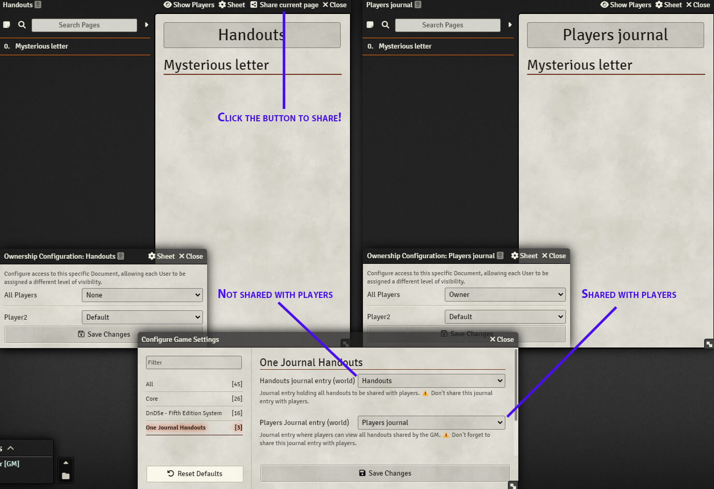

# One Journal Handouts

One Journal Handouts: an easy way to manage and share handouts. Add all handouts in one unique journal entry (or don't) and share them with a single click to all player's in a dedicated players journal entry. No more multiple journal entries for handouts. Keep your originals handouts intact. Keep track of the order in which the handouts are shared.

